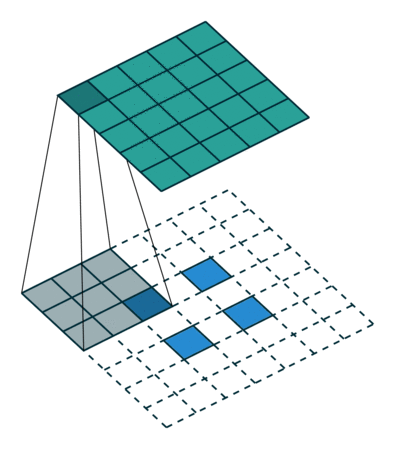

[TOC]

## 依赖知识

a) 熟悉[全连接层、损失函数的反向传播](0_1-全连接层、损失函数的反向传播.md)

b) 熟悉[卷积层的反向传播-单通道、无padding、步长1](0_2_1-卷积层的反向传播-单通道、无padding、步长1.md)

c) 熟悉[卷积层的反向传播-多通道、无padding、步长1](0_2_2-卷积层的反向传播-多通道、无padding、步长1.md)

d) 熟悉以上三点的依赖知识

## 约定说明

a) $l$ 代表网络的第$l$ 层, $z^l$ 代表第$l$ 层卷积，$z_{d,i,j}^l$ 代表第$l$ 层卷积第$d$ 通道$(i,j)$ 位置的值; $z^l$ 的通道数为$C^l$, 高度和宽度分别为$H^l,\hat W^l$ ($\color{red}{避免与权重相同}$) 

b) $W^{l-1},b^{l-1}$ 代表连接第$l-1$ 层和第$l$ 层的卷积核权重和偏置; 卷积核的维度为$(k_1^{l-1},k_2^{l-1})$ ; 卷积核的步长为$(s_1^{l-1},s_2^{l-1})$。

c) 记损失函数L关于第$l$ 层卷积的输出$z^l$ 的偏导为$\delta^l = \frac {\partial L} {\partial z^l}  \ \ \ (3)$   

## 前向传播

​        根据以上约定，卷积核权重$W^{l-1} \in \Bbb R^{k_1^{l-1} \times k_2^{l-1} \times C^{l-1} \times C^{l}}$ ,偏置$b^{l-1} \in \Bbb R^{C^l}$ ,每个输出通道一个偏置。 则有第$l$ 层卷积层,第$d$个通道输出为:
$$
\begin{align}
&z^l_{d,i,j} = \sum_{c=1}^{C^{l-1}}\sum_{m=0}^{k_1^{l-1}-1} \sum_{n=0}^{k_2^{l-1}-1} W_{m,n,c,d}^{l-1} z_{c,i \cdot s_1^{l-1}+m,j \cdot s_2^{l-1}+n}^{l-1} + b^{l-1}_d  & i \in [0,H^l-1], j\in [0,\hat W^l-1]\tag 4
\end{align}
$$

​       其中：$H^l = (H^{l-1} - k_1^{l-1})/s_1^{l-1} + 1;\ \ \ \ \  \hat W^l = (\hat W^{l-1} - k_2^{l-1})/s_2^{l-1} + 1 $ ;

## 反向传播

### 权重梯度

a) 首先来看损失函数$L$关于第$l-1$层权重$W^{l-1}$和偏置$b^{l-1}$的梯度：
$$
\begin{align}
&\frac {\partial L} {\partial W_{m,n,c,d}^{l-1}} 
= \sum_i \sum_j \frac {\partial L} {\partial z^l_{d,i,j}} * \frac {\partial z^l_{d,i,j}} {\partial W_{m,n,c,d}^{l-1}} &//l层的d通道每个神经元都有梯度传给权重W^{l-1}_{m,n,c,d}\\
&=\sum_i \sum_j \delta^l_{d,i,j} * \frac {\partial ( \sum_{c=1}^{C^{l-1}}\sum_{m=0}^{k_1^{l-1}-1} \sum_{n=0}^{k_2^{l-1}-1} W_{m,n,c,d}^{l-1} z_{c,i \cdot s_1^{l-1}+m,j \cdot s_2^{l-1}+n}^{l-1} + b^{l-1}_d  )} {\partial W^{l-1}_{m,n,c,d}}  \\
&=\sum_i \sum_j \delta^l_{d,i,j} * z_{c,i \cdot s_1^{l-1}+m,j \cdot s_2^{l-1}+n}^{l-1} \tag 5
\end{align} \\
$$

​          对比公式(5)和[单通道](0_2_1-卷积层的反向传播-单通道、无padding、步长1.md)中公式(4),可以发现,损失函数$L$关于第$l-1$层权重$W^{l-1}_{:,:c,d}$梯度就是以$\delta^{l_{padding}}$ (后面会说明它的含义) 为卷积核在$z^{l-1}_c$上做卷积的结果(这里没有偏置项),单通道对单通道的卷积。

b) 损失函数$L$关于第$l-1$层偏置$b^{l-1}$的梯度同
$$
\begin{align}
\frac {\partial L} {\partial b^{l-1}_d} =\sum_i \sum_j \delta^l_{d,i,j}  \tag 6
\end{align}
$$

### l-1层梯度

​         直接从公式推导损失函数关于第$l-1$层输出的偏导比较难，我们参考转置卷积论文[A guide to convolution arithmetic for deep learning](https://arxiv.org/abs/1603.07285) 知识，我们以另外一种方式证明; 对于如下的图,上一层为输入的卷积层($5 \times 5$) ，用($3 \times 3$) 的卷积核以步长为2,做卷积得到下一层卷积大小为$2 \times 2$ (图中蓝色的点)。如果我们将输出卷积的每行和每列之间填充步长减一的行列，行列的元素全为0。记卷积层$z^l$ 使用这种零填充后的卷积层为 $z^{l_{padding}}$ 。那么前向过程其实就相当于卷积核，在输入卷积上以不为1的步长卷积后的结果就是$z^{l_{padding}}$。

​         那么反向过程也是一样，相当于翻转后的卷积在相同零填充的$\delta^l$ 上左卷积的结果，设$\delta^{l_{padding}}$ 为$\delta^l$ 的行列分别填充$(s_1^{l-1}-1,s_2^{l-1}-1)$ 行列零元素后的梯度矩阵。则根据[多通道](0_2_2-卷积层的反向传播-多通道、无padding、步长1.md) 中的公式(8) 有
$$
\delta^{l-1}_{c,i,j}=\sum_{d=1}^{C^l}\sum_{m=0}^{k_1^{l-1}-1} \sum_{n=0}^{k_2^{l-1}-1}rot_{180^\circ} W^{l-1}_{m,n,c,d}p\delta^{l_{padding}}_{d,i+m,j+n} \tag 8
$$

​           其中$p\delta^{l_{padding}}_{d,i,j}$ 是$\delta^l$ 在行列直接插入$(s_1^{l-1}-1,s_2^{l-1}-1)$ 行列零元素后(即$\delta^{l_{padding}}$)，再在元素外围填充高度和宽度为 $(k_1^{l-1}-1,k_2^{l-1}-1)$ 的零元素后的梯度矩阵。

## 参考

a) [A guide to convolution arithmetic for deep learning](https://arxiv.org/abs/1603.07285)

